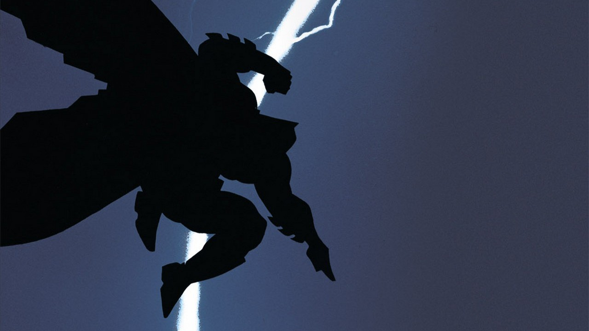
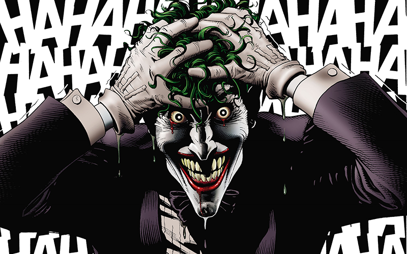
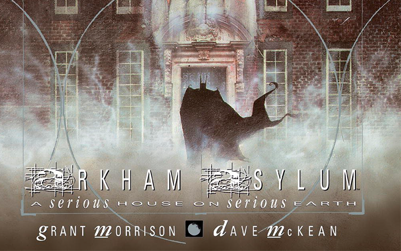
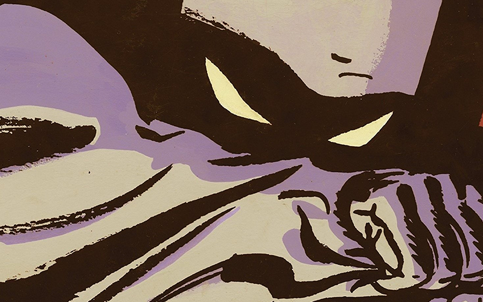
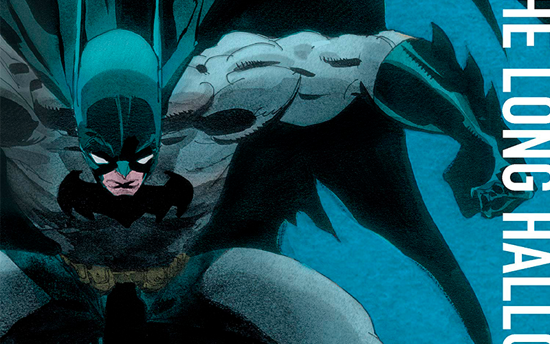

Batman é um personagem criado pelo escritor Bill Finger e pelo artista Bob Kane em maio de 1939.

Depois de mais de 80 anos em publicação ele é um dos personagens mais famosos dos quadrinhos,
com diversas versões em filmes, séries, jogos e todos os formatos de mídia possível.

Mas com tanto tempo de história e com milhares de quadrinhos já publicados,
como começar a ler as melhores histórias do Batman?

Nesse artigo vamos elencar as 5 melhores HQs do Batman

### Batman - O Cavaleiro Das Trevas

**Criadores:** Frank Miller

Dez anos após Batman se aposentar, a cidade de Gotham vive seus piores dias, assombrada pela alta criminalidade e
por uma nova gangue chamada de "Os Mutantes". Vendo o desfecho que sua cidade levou, Batman resolve retornar a ativa.
Publicada em 1986, O Cavaleiro das trevas, ao lado de Watchmen, mudou o mercado de quadrinhos da época,
estabelecendo novos parâmetros, tanto em narrativa como em temática, e
influenciando tudo o que veio depois.

_Compre **com desconto** o volume - O Cavaleiro Das Trevas_ - <a href="https://amzn.to/3rwYpCZ">Clique aqui!</a>

### Batman - A Piada Mortal

**Criadores:** Alan Moore e Brian Bolland

Um dia ruim. É apenas isso que separa o homem da loucura. Pelo menos menos segundo o Coringa,
um dos maiores e mais conhecidos vilões dos quadrinhos. E ele quer provar seu ponto de vista enlouquecendo
ninguém menos que o maior aliado de seu grande inimigo: o Comissário Gordon. Cabe ao Cavaleiro das Trevas impedi-lo.

_Compre **com desconto** o volume - A Piada Mortal_ - <a href="https://amzn.to/3jsHMW7">Clique aqui!</a>

### Asilo Arkham - Uma Séria Casa em um Sério Mundo

**Criadores:** Grant Morrison e Dave McKean

A HQ mais psicótica do Batman.
Escrita pelo gênio dos quadrinhos GRANT MORRISON (LJA, Os Invisíveis, Novos X-Men) e lindamente
pintada por DAVE McKEAN (Sandman, Mr. Punch, Cages), essa controversa narrativa gráfica acompanha
Batman enquanto encara seus mais perigosos inimigos e seus piores demônios interiores.

_Compre **com desconto** o volume - Asilo Arkham_ - <a href="https://amzn.to/2N8GxiL">Clique aqui!</a>

### Batman - Ano Um

**Criadores:** Frank Miller

Como o Batman nasceu? Como Bruce Wayne decidiu se vestir de morcego para combater o crime pela cidade? Quem ficaria do lado dele?
Todas essas perguntas são respondidas nessa HQ.
Frank Miller conta a história de origem do Batman que serviu como base para todos os filmes/animações do personagem.

_Compre **com desconto** o volume - Ano Um_ - <a href="https://amzn.to/3jsyLwz">Clique aqui!</a>

### Batman - O Longo Dia das Bruxas

**Criadores:** Jeph Loeb e Tim Sale

Umas das HQs que inspirou o famoso filme Batman O Cavaleiro das Trevas.
O Longo Dia das Bruxas se passa no começo da carreira do Batman, contando a história de um assassino que ataca suas vítimas
somente em feriados, Batman trabalha com o promotor público Harvey Dent e o tenente James Gordon numa corrida contra o relógio
para capturar o criminoso.
Essa história também retrata os eventos que transformaram Harvey Dent em um dos piores inimigos do herói.

_Compre **com desconto** o volume - O Longo Dia das Bruxas_ - <a href="https://amzn.to/3tB5LXV">Clique aqui!</a>
