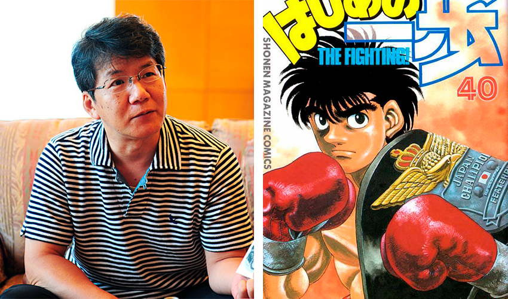
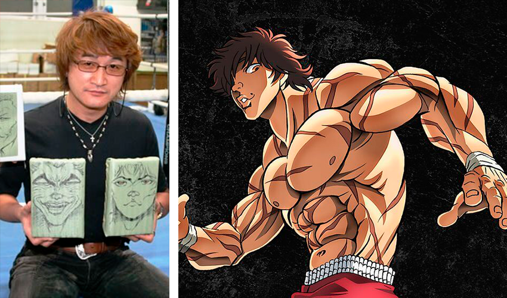
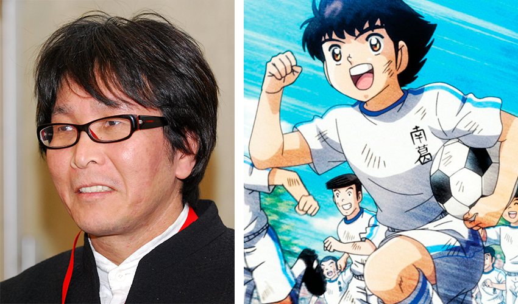
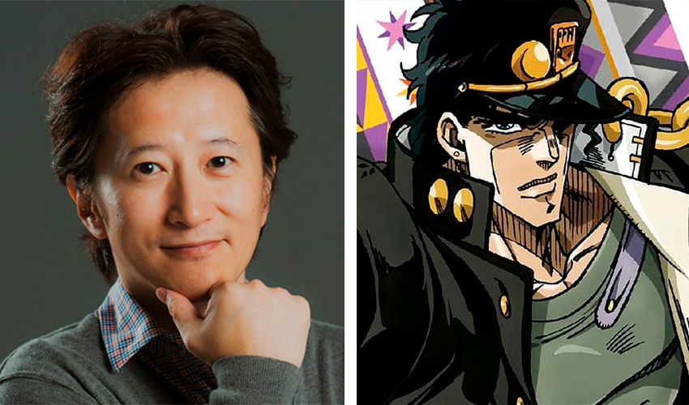
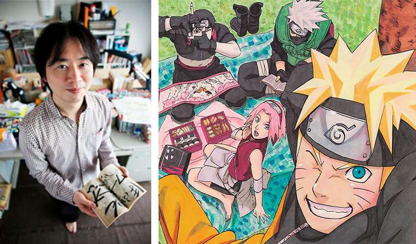
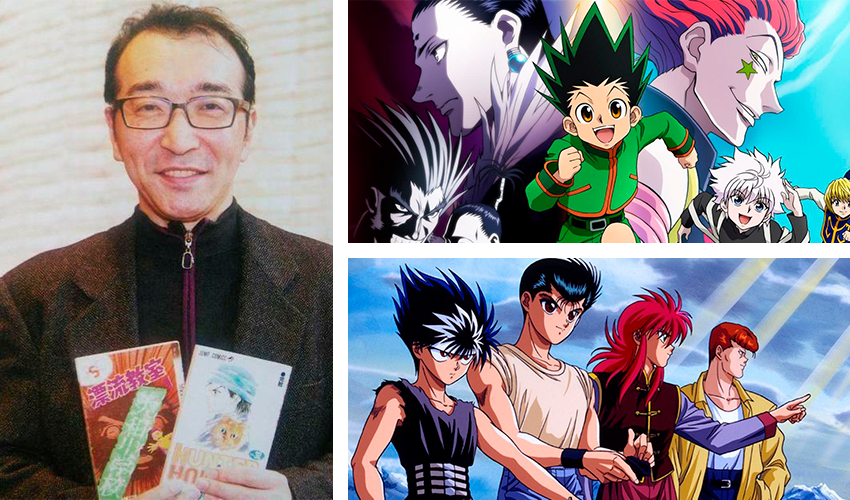
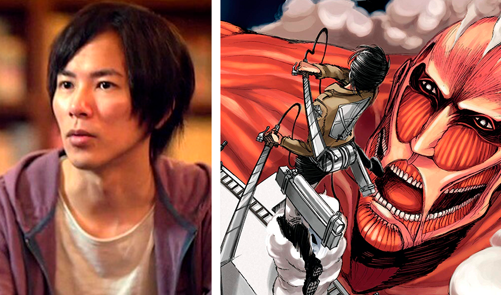
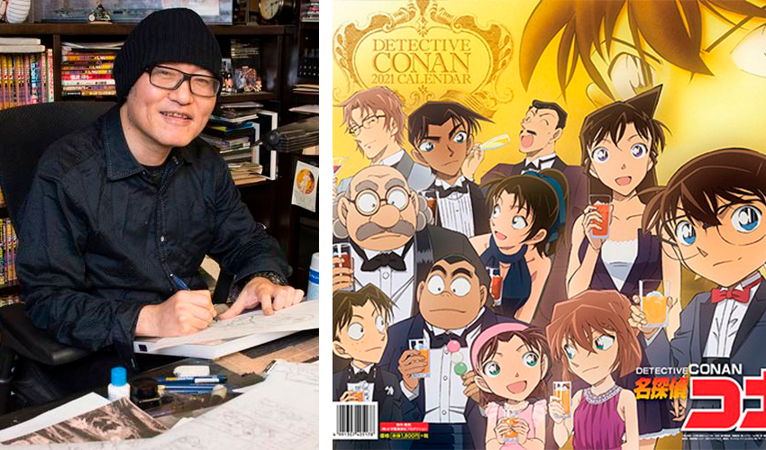
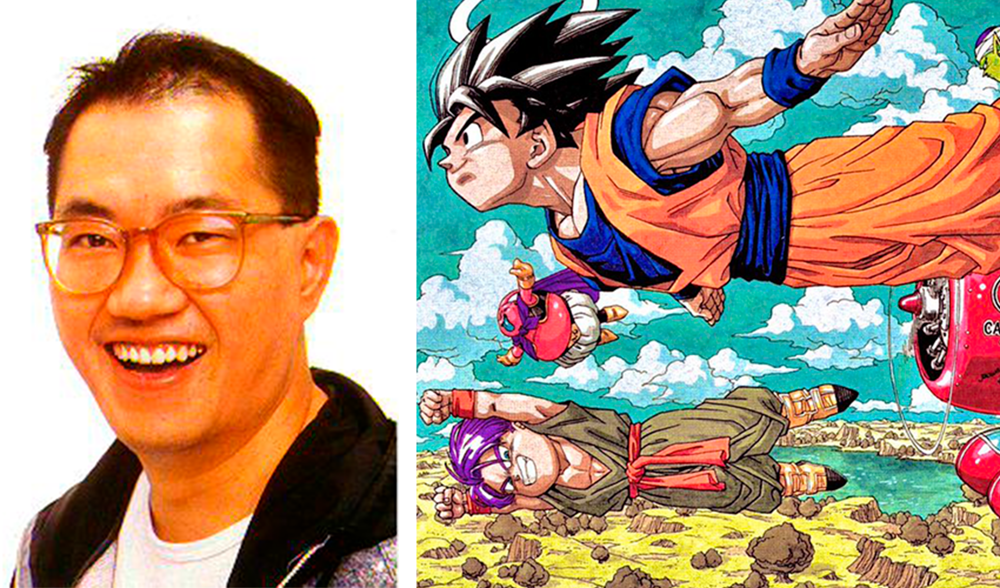
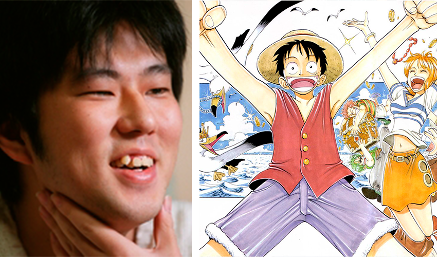

### 10 - George Morikawa

_Autor de Hajime no Ippo._

Hajime no Ippo é um manga sobre Boxe que está sendo publicado a mais de 20 anos.
A série começou em 1989 e ainda não a sinal de acabar tão cedo mesmo tendo 129 volumes publicados até agora.
Morikawa tem uma fortuna estimada em **3 milhões de dólares**.

### 9 - Keisuke Itagaki

_Autor de Grappler Baki._

Grappler Baki conta a história de um lutador que deseja se tornar mais forte que seu pai que é conhecido como o ser vivo mais forte do planeta.
Baki já vendeu em torno de 75 a 80 milhões de volumes.
Keisuke Itagaki tem uma fortuna estimada em **5 milhões de dólares**.

### 8 - Yōichi Takahashi

_Autor de Super Campeões(Captain Tsubasa)._

Super Campeões é um dos maiores mangás de esporte de todos os tempos e conhecido por criar o interesse de futebol nos Japones.
As vendas da série totalizam mais de 80 milhões de volumes.
Takahashi tem um fortuna avaliada em aproximadamente **5 milhões de dólares**.

### 7 - Hirohiko Araki

_Autor de JoJo’s Bizarre Adventure._

JoJo’s Bizarre Adventure começou a ser publicado em 1987 e ainda está em produção, sendo o segundo mangá mais longo da Shonen Jump com 127 volumes.

O mangá conta a história da família Joestar e suas lutas contra forças sobrenaturais.
A obra é dividida em 8 partes e cada uma conta a história de uma linhagem da família.

Hirohiko Araki tem uma fortuna aproximada de **10 a 13 milhões de doláres**.

### 6 - Masashi Kishimoto

### 5 - Yoshihiro Togashi

### 4 - Hajime Isayama

### 3 - Gosho Aoyama

### 2 - Akira Toriyama

### 1 - Eiichiro Oda

