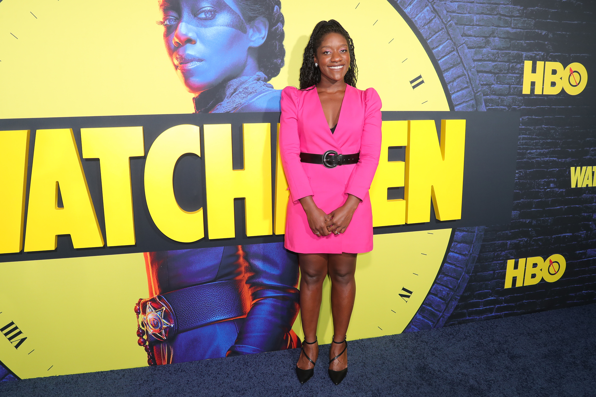
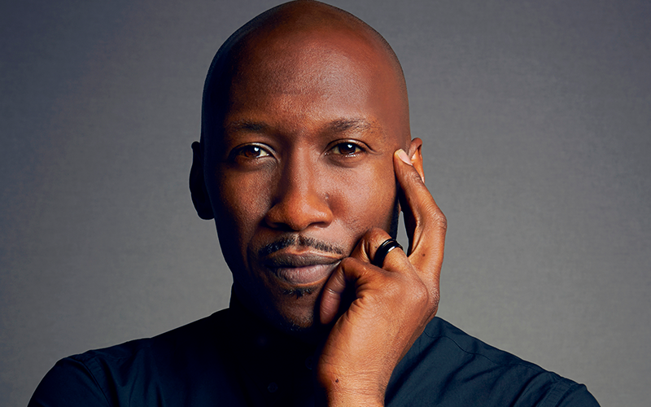

Stacy Osei-Kuffou, que já roteirizou Watchmen para a HBO, será a nova roteirista do filme estrelado por Mahershala Ali.
Infelizmente o filme ainda não tem nenhuma previsão de lançamento.
O longa foi anunciado em julho de 2019 durante o painel da Marvel Studios na San Diego Comic Con.

Blade foi um dos primeiros filmes de Super-Heróis de sucesso, e teve sua estreia em 1998 se tornando uma trilogia que foi finalizada em 2004.

### Quem é Stacy Osei-Kuffou?

Escritora e atriz, ela é conhecida pela produção de Watchman da HBO (2019), também roteirizou Pen15 (2019), Run (2020), e Hunters (2020) na Amazon Prime.

### Quem é Mahershala Ali?

Ator e rapper norte-americano que venceu dois óscares de melhor ator coadjuvante pelos filmes Moonlight (2017) e Green Book (2019),
é o primeiro ator muçulmano a ganhar o Oscar.
