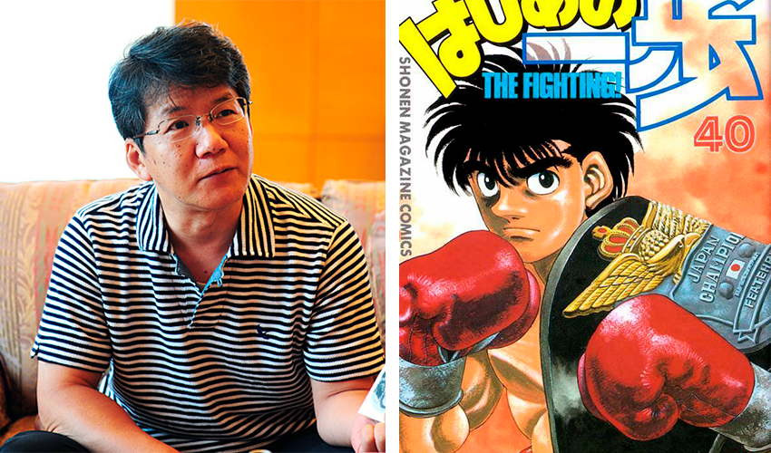
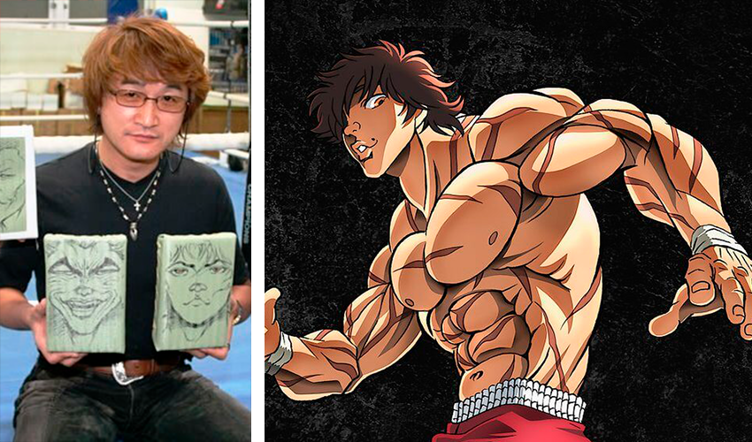
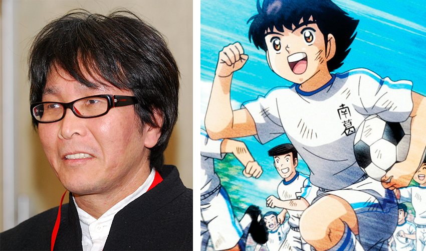
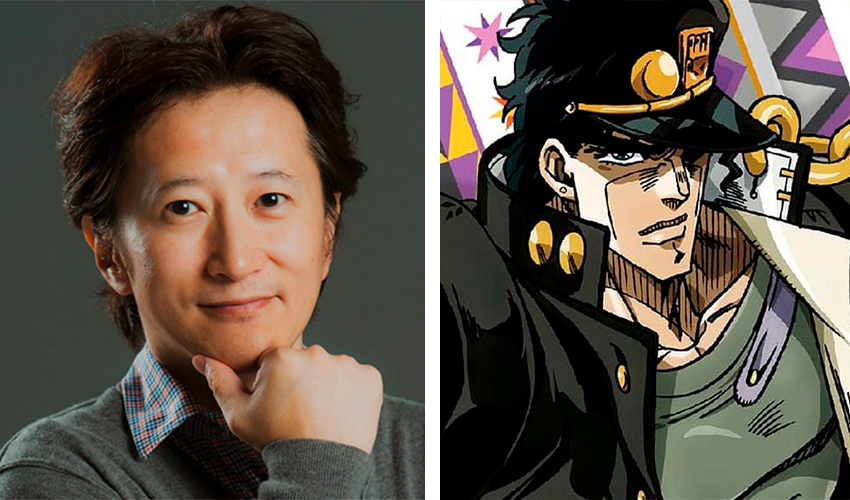
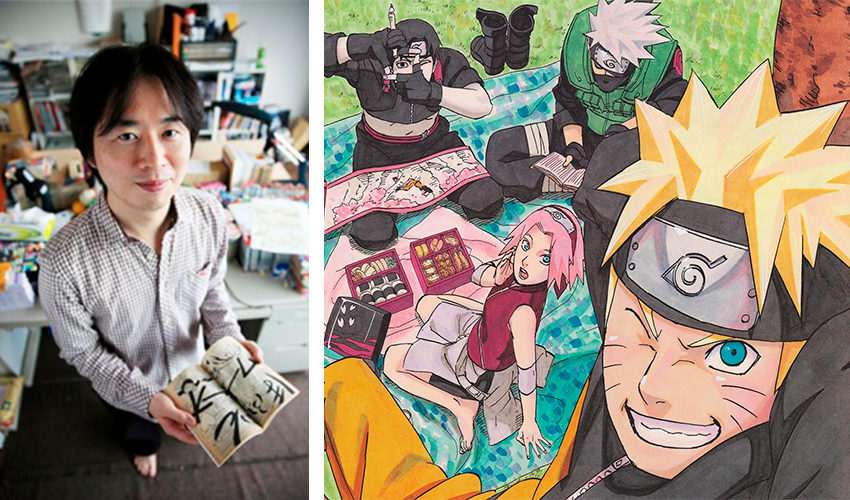
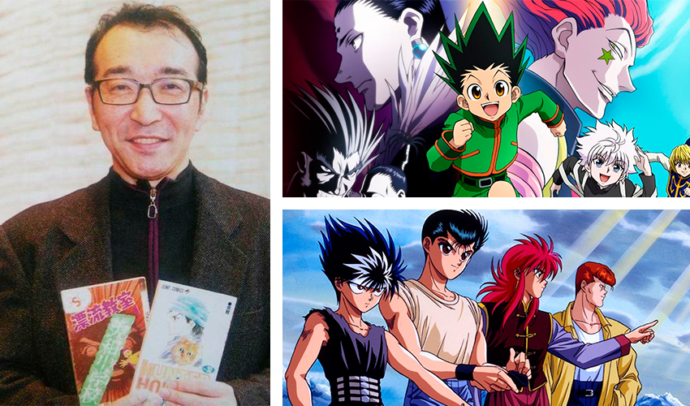
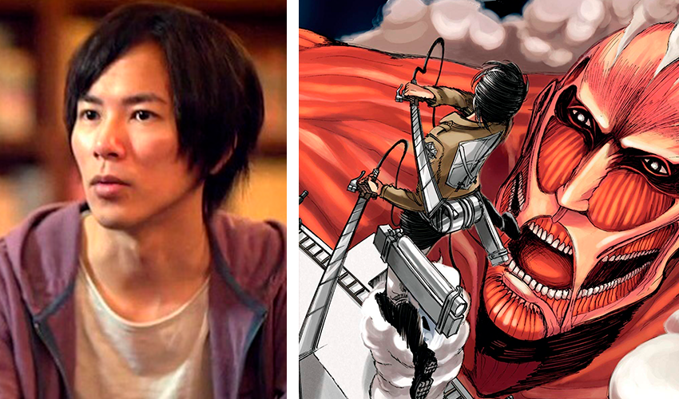
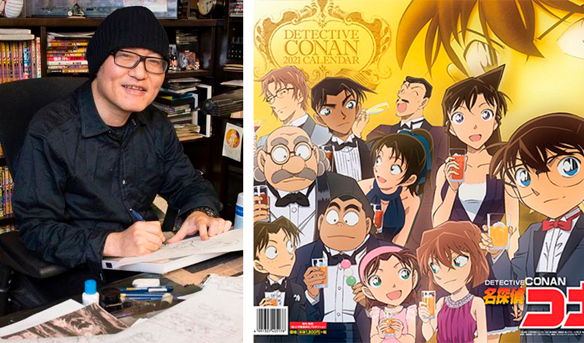
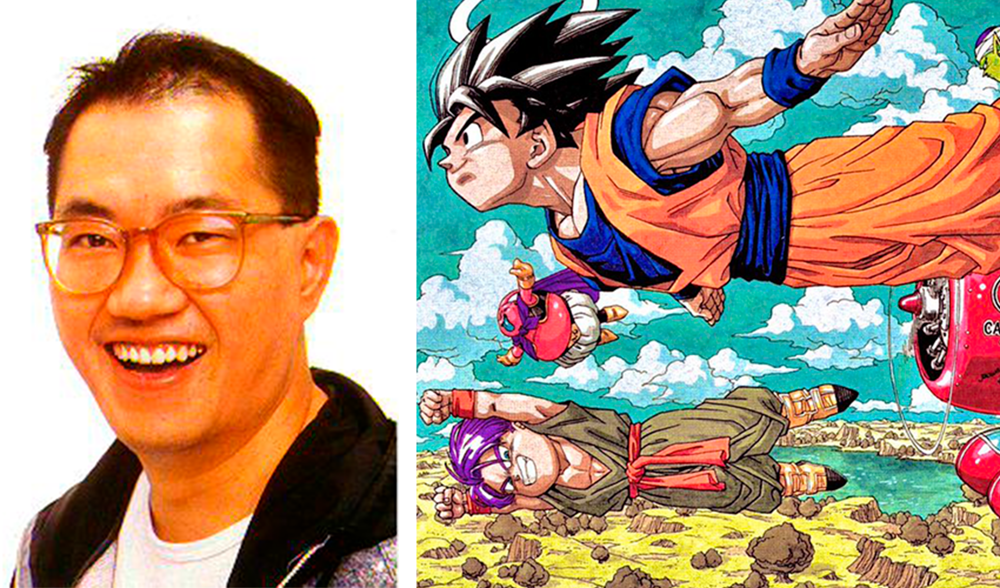
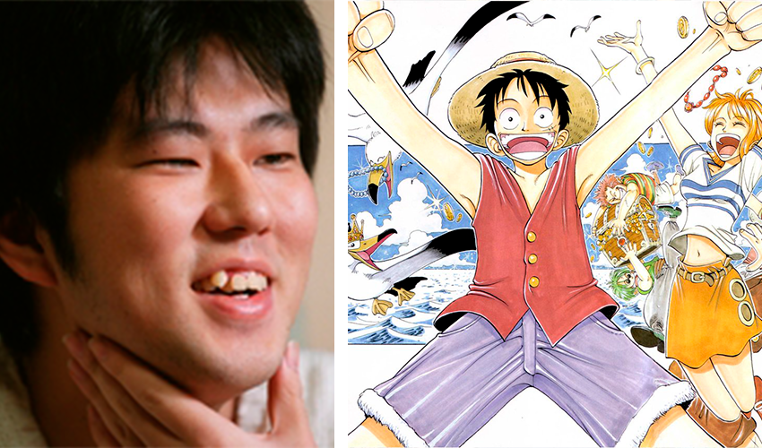

 

### 10 - George Morikawa

_Autor de **Hajime no Ippo**._

Hajime no Ippo é um mangá sobre Boxe que está sendo publicado há mais de 20 anos.
A série começou em 1989 e ainda não deu sinal de acabar tão cedo mesmo tendo 129 volumes publicados até agora.
Morikawa tem uma fortuna estimada em **3 milhões de dólares**.

### 9 - Keisuke Itagaki

_Autor de **Grappler Baki**._

Grappler Baki conta a história de um lutador que deseja se tornar mais forte que seu pai que é conhecido como o ser vivo mais forte do planeta.
Baki já vendeu em torno de 75 a 80 milhões de volumes.
Keisuke Itagaki tem uma fortuna estimada em **5 milhões de dólares**.

### 8 - Yōichi Takahashi

_Autor de **Super Campeões(Captain Tsubasa)**._

Super Campeões é um dos maiores mangás de esporte de todos os tempos e conhecido por criar o interesse ao futebol nos japoneses.
As vendas da série totalizam mais de 80 milhões de volumes.
Takahashi tem um fortuna avaliada em aproximadamente **5 milhões de dólares**.

### 7 - Hirohiko Araki

_Autor de **JoJo’s Bizarre Adventure**._

JoJo’s Bizarre Adventure começou a ser publicado em 1987 e ainda está em produção, sendo o segundo mangá mais longo da Shonen Jump com 127 volumes.

O mangá conta a história da família Joestar e suas lutas contra forças sobrenaturais.
A obra é dividida em 8 partes e cada uma conta a história de uma linhagem da família.

Hirohiko Araki tem um patrimônio de aproximadamente **10 a 13 milhões de dólares**.

_Compre os volumes de JoJo’s Bizarre Adventure_ - <a href="https://amzn.to/36QPog1" target="\_blank">Clique aqui!</a>

### 6 - Masashi Kishimoto

_Autor de **Naruto**._

Naruto é um dos mangás mais famosos da história, tendo uma legião de fãs ao redor do mundo.
A série Naruto, incluindo sua continuação, Boruto, que conta a história do filho de Naruto, vendeu aproximadamente 250 milhões de volumes.
Apesar do grande sucesso da série, Masashi Kishimoto tem um patrimônio estimado em **20 a 25 milhões de dólares**, claro que um grande número
mas levando em consideração o impacto de Naruto é uma quantia curiosamente pequena.

_Compre os volumes de Naruto_ - <a href="https://amzn.to/3jDF3tn" target="\_blank">Clique aqui!</a>

### 5 - Yoshihiro Togashi

_Autor de **Hunter x Hunter e Yu Yu Hakusho**._

Yoshihiro Togashi, conhecido por seus grandes hiatos devido a problemas de saúde, possui duas séries de grande sucesso.

Yu Yu Hakusho foi publicado entre 1990 e 1994 em 19 volumes, mas apesar de poucos volumes vendeu aproximadamente 50 milhões de cópias no Japão.

Hunter x Hunter por sua vez começou a ser publicado em 1998, apesar do mangá ter mais de 20 anos ele só tem 390 capítulos publicados,
devido aos constantes hiatos. Atualmente o mangá está em hiato desde dezembro de 2018, mas mesmo com as complicações em sua publicação,
Hunter x Hunter já vendeu 80 milhões de volumes.

Yoshihiro Togashi tem um patrimônio avaliado em aproximadamente **25 milhões de dólares**.

_Compre os mangás de Yoshihiro Togashi_ - <a href="https://amzn.to/3rwSy0m" target="\_blank">Clique aqui!</a>

### 4 - Hajime Isayama

_Autor de **Attack on Titan**._

Attack on Titan é um dos mangás mais vendidos de todos os tempos, atingindo a marca de 100 milhões de cópias vendidas até dezembro de 2019.
A série começou a ser publicada em 2009 pela Bessatsu Shonen Magazine.
A série possui 5 spin-off em mangá, 3 livros, anime, video games e filmes live-action.
Attack on Titan conta a história de uma sociedade ameaçada por gigantes humanoides chamados de _"Titãs"_.

Hajime Isayama acumulou uma fortuna pessoal de **45 milhões de dólares**

_Compre os volumes de Ataque dos Titãs_ - <a href="https://amzn.to/2O7cI2C" target="\_blank">Clique aqui!</a>

### 3 - Gosho Aoyama

_Autor de **Case Closed (Detective Conan)**._

Case Closed conta a história de um detetive que teve seu corpo rejuvenescido e voltou a ter um corpo de uma criança de 7 anos,
e precisa lidar com a escola primária enquanto resolve crimes.

A série começou a ser publicada em 1994 e está em andamento até hoje, totalizando mais de 90 volumes e vendendo mais de
230 milhões de cópias.

Gosho Aoyama tem um patrimônio avaliado em aproximadamente **50 milhões de dólares**.

### 2 - Akira Toriyama

_Autor de **Dragon Ball**._

Akira Toriyama é um dos mangakás mais influentes da história, com osos volumes de Dragon Ball passando de 300 milhões de cópias vendidas,
a sua obra também é uma das responsáveis por popularizar os mangás no Ocidente.

Akira também é responsável pelo design dos personagens da série de video games Dragon Quest.

Nascido em 5 de Abril de 1955, Toriyama tem uma fortuna de aproximadamente **50 milhões de dólares**.

_Compre os volumes de Dragon Ball_ - <a href="https://amzn.to/36TVs7w" target="\_blank">Clique aqui!</a>

### 1 - Eiichiro Oda

_Autor de **One Piece**._

One piece está sendo publicado desde 1997, com mais de 1000 capítulos, a série já vendeu mais de 473 milhões de volumes no mundo todo.
One piece é o mangá mais vendido de todos os tempos.

A série conta a história de Luffy, um jovem que pode esticar como borracha após comer a Fruta do Demônio. Luffy sonha em se tornar o rei dos piratas
e sai em busca do One Piece, o maior tesouro de todos, junto com sua tripulação conhecida como o Bando do Chapéu de Palha.

Nascido em 1 de Janeiro de 1975, Eiichiro Oda entrou para o Guinness Book com o recorde de
“maior quantidade de exemplares vendidos de uma série em quadrinhos por um único autor”.

Oda é o mangaká mais rico da história. Ele possui um patrimônio de aproximadamente **200 milhões de dólares**.

_Compre os volumes de One Piece_ - <a href="https://amzn.to/3aB45ow" target="\_blank">Clique aqui!</a>
