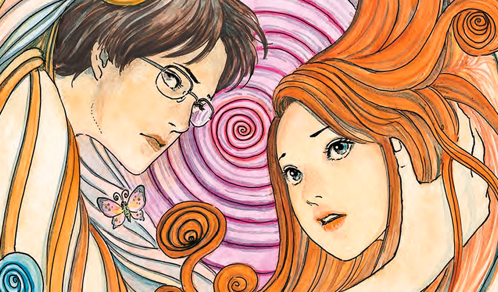

Junji Ito é um artista de mangá japonês, especialista em histórias de horror. Nasceu em Gifu, no Japão, em 1963.
Desde muito novo, foi inspirado por suas irmãs desenhistas, e tem influências como Kazuo Umezu e Shinichi Koga.
O artista passou sua infância no campo em uma casa onde o banheiro era no final de um túnel escuro, que era morada
de muitos insetos, grilos e aranhas, isso influenciou muito em seus futuros contos.

De dentista à Mangaká, Junji ito desenhava e escrevia mangas apenas como hobby para passar o tempo e trabalhava na área
odontológica como técnico. Em 1987 ele enviou um de seus contos para Monthly Halloween, e ganhou uma menção honrosa no
Kazuo Umezu Prize, onde Kazuo Umezu, seu ídolo, estava presente como um dos juízes. Este conto se tornou o primeiro trabalho de Ito, Tomie.

**Curiosidade**: O artista Junji Ito teria sido originalmente um dos colaboradores de Silent Hill,
entretanto o projeto foi cancelado depois de um ano pela Konami, dona do videogame.

### As Obras

#### Tomie

Narra a história de uma garota imortal chamada Tomie, uma mulher misteriosa que ninguém sabe como e onde surgiu.
Ela liberta o sentimento mais difícil de se controlar, o amor, mas não o lado fácil e bonito, e sim o pior lado desse sentimento,
a fascinação e a violência. Seduzindo qualquer tipo de homem, e os induzindo a fazer o que bem quer, inclusive matar.
Muitos querem ter ela para si, outros temem por ela ser o que é. Mas todos logo percebem que não importa quantas vezes a matem, ela sempre estará lá.

_Compre os volumes de Tomie_ - <a href="https://amzn.to/2MIsD7k">Clique aqui!</a>

#### Gyo

Gyo é um mangá de terror seinen, que possui dois volumes onde os peixes são controlados por uma cepa de bactérias sencientes
chamada de "fedor de morte". O mangá aproveita todas as fobias referentes ao fundo do mar, e faz uma mistura de ciência com
uma conclusão que se encaixa perfeitamente com o fim da obra. O mangá possui 19 capítulos e é muito interessante,
o leitor consegue se prender facilmente na história.

_Compre Hellstar Remina_ - <a href="https://amzn.to/3rpY1pM">Clique aqui!</a>

#### Uzumaki

É uma série de três volumes sobre uma cidade assombrada pela entidade sobrenatural da espiral.
Não envolve fantasmas ou demônios, mas os habitantes dessa cidade são fascinados
pelo padrão geométrico que domina suas mentes. É uma das maiores obras do mestre Ito, se não a mais conhecida dele.
A história acompanha a protagonista Kirie Goshim, que é uma estudante de colegial.
Os contos vão se desenvolvendo com o dia a dia da colegial, onde Kirie descobre que cada vez mais essa cidade é
dominada pela grande fascinação por espirais.

_Compre Uzumaki_ - <a href="https://amzn.to/2Oc7Pp3">Clique aqui!</a>

#### Hellstar Remina

Remina é uma garota do colegial que teve sua vida revirada de cabeça para baixo por causa do seu pai,
que é um astrólogo que descobriu um novo planeta no universo e o batizou com o nome de sua amada filha, Remina.
O que não esperavam é que o planeta remina não era um planeta comum e sim um "planeta" que se alimentava de outros planetas.
Nisso todos acham que a calma, tímida e solitária Remina pode ter algo haver com o "planeta" e que ela deve ser até crucificada por isso.

_Compre Hellstar Remina_ - <a href="https://amzn.to/3cQO7te">Clique aqui!</a>
