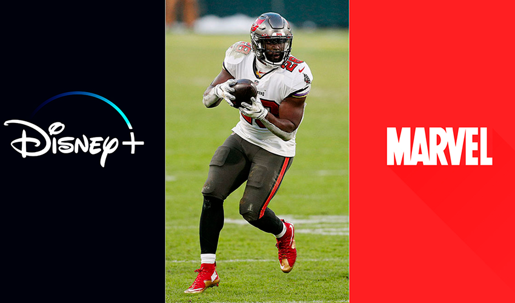
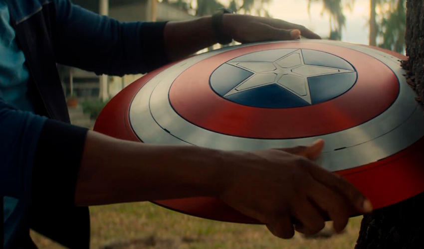

A nova série Falcão e o Soldado Invernal chega ao catálogo da Disney+ no dia 19 de
março de 2021, e a Marvel Studios lançou um trailer inédito durante o Super Bowl
recheado de ação, humor e surpresas. Vamos te contar todos os detalhes encontrados
nesse novo trailer.

### O que é Super Bowl?

É o jogo final do campeonato da NFL, a principal liga de futebol Americano dos EUA,
que decide o campeão da temporada. Tradicionalmente os maiores estúdios revelam
alguns dos comerciais e trailers dos filmes mais esperados pelo público no ano.
E esse ano não seria diferente, o novo trailer de falcão e o soldado invernal
foi revelado e com ele muitas teorias já estão sendo colocadas na mesa.

**Curiosidade**: Foi durante o Super Bowl do ano passado que a Marvel Studios
estreou a primeira filmagem oficial de The Falcon and the Winter Soldier,
juntamente com a filmagem do WandaVision que estava em andamento e do próximo Loki.

### Sobre a dupla, a volta do Barão Zemo e o retorno de Sharon Carter

Embora Sam e Bucky ao longo do decorrer dos filmes da Marvel tenham desenvolvido
uma parceria, sabemos que a saída do Capitão América vai trazer desentendimentos
entre os dois e logo na primeira cena do trailer já conseguimos ver a dupla sendo
interrogada, principalmente sobre como incomodam e irritam um ao outro.

Barão Zemo será novamente o vilão da temporada e além de mostrar sua icônica
máscara roxa o vilão deixa claro sua nova missão, aniquilar os super-heróis.

Um dos grandes destaques do trailer foi a volta de Sharon Carter, que é a neta
de Peggy Carter, do filme Capitão America 2: Soldado Invernal de 2014, já volta
intimidando, e lutando em uma cena de porradaria.

E apesar da prévia nos mostrar muita ação, sabemos que a série estará recheada de
humor, principalmente pela rixa da dupla principal.

### E afinal, quem ficará com o escudo do Capitão America?

Vimos que no final de Vingadores: Ultimato o escudo foi entregue pelo próprio
Steve Rogers ao Sam Wilson. E o trailer não só mostra o falcão equipado com
o escudo mas também o passando para o Bucky em uma cena que apesar de ser
rápida nos recorda que assim como nas HQ's eles disputam quem assumirá o
manto do Capitão América.

Confira aqui o Trailer lançado no Super Bowl:

<iframe
  width="560"
  height="315"
  src="https://www.youtube.com/embed/ZHaokMTWgdY"
  frameborder="0"
  allow="accelerometer; autoplay; clipboard-write; encrypted-media; gyroscope; picture-in-picture"
  allowfullscreen
></iframe>

_Compre HQs do Soldado Invernal_ - <a href="https://amzn.to/3q5HF5D">Clique aqui!</a>
