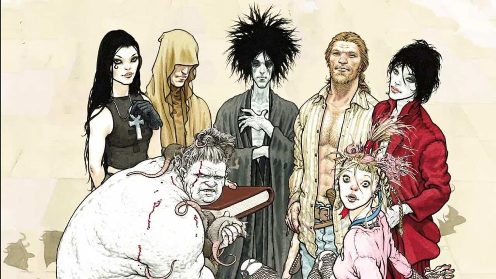
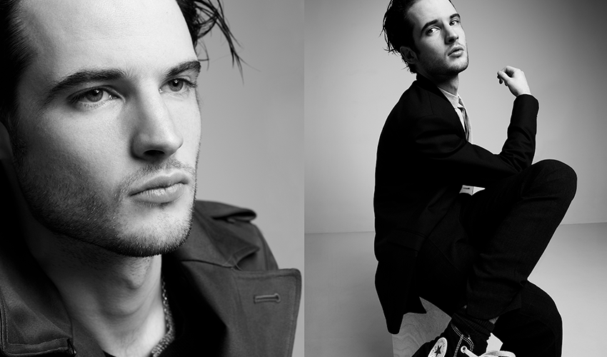
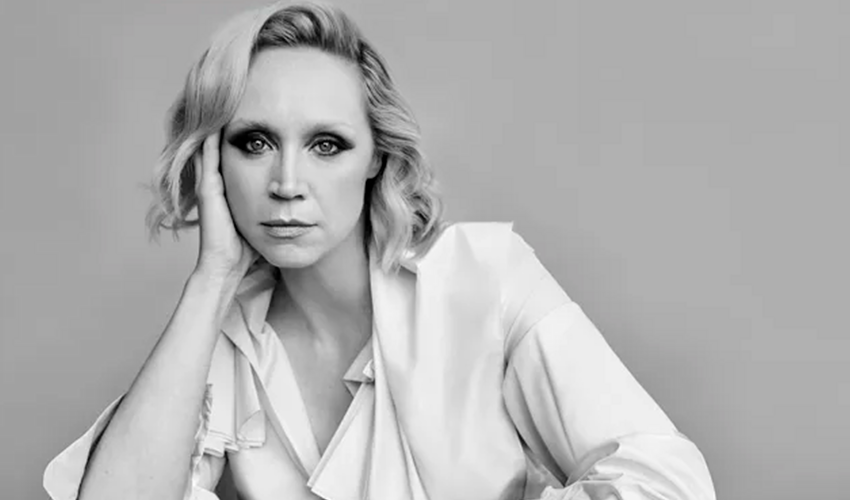
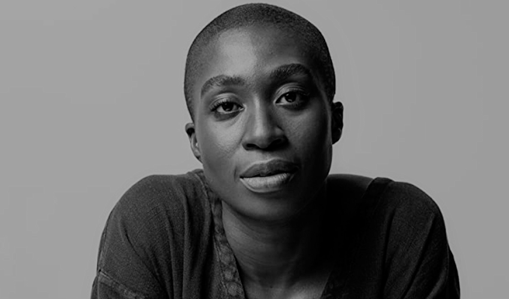
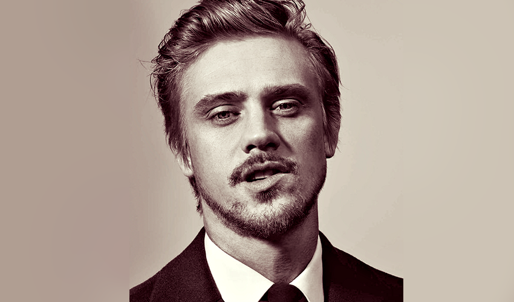
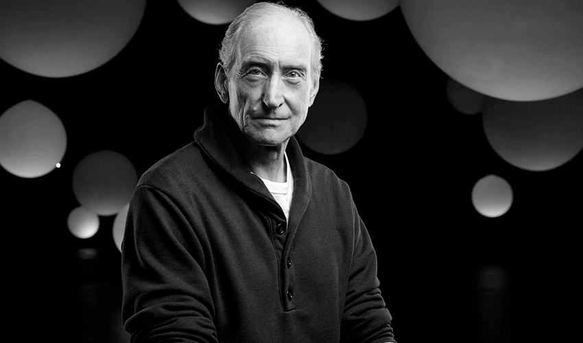
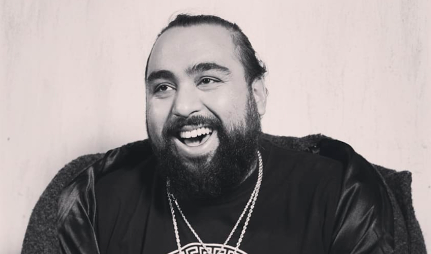
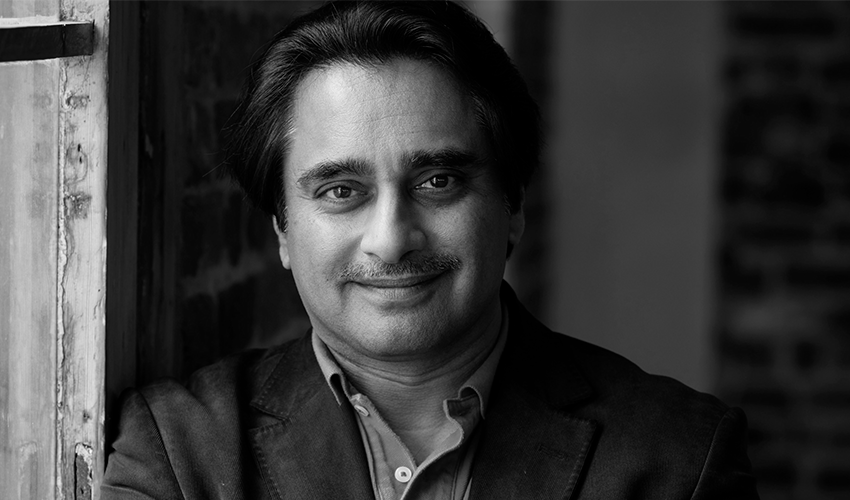

A nova adaptação de The Sandman para Netflix ainda não possui data de estréia, mas já sabemos que as filmagens começaram em outubro
de 2020 e de acordo com a entrevista do Digital Spy o próprio Neil Gaiman confirmou que a série chegará ao serviço de streaming provavelmente pelo segundo semestre.

### Sobre The Sandman

Sandman é uma série de quadrinhos para adultos multipremiada, é escrita pelo Neil Gaiman e publicada pela editora Vertigo, um dos selos da DC Comics.

As histórias contam a vida de Sonho, que é o governante do sonhar, ele é um dos 7 Perpétuos que representam manifestações morfológicas
de figuras comuns aos seres humanos, como Destino, Morte, Sonho, Destruição, Desejo, Desespero e Delírio.
Os 7 Perpétuos não são deuses e sim entidades do além designados a assegurar o que conhecemos como realidade.
Apenas suas existências mantém o universo físico e todos os seres vivos coesos.

Na história, um grupo de humanos que desejavam a imortalidade tentaram capturar a Morte, entretanto o plano dá errado e eles
acabam capturando o irmão da Morte, o Sonho (Sandman).

### Confira o Elenco Completo da Série

#### Tom Sturridge é o Sonho, Senhor dos Sonhos

Tom é um ator britânico de 35 anos que já atuou nos filmes Mary Shelley (2017) que está no catálogo da Netflix e Effie Gray (2014).

#### Gwendoline Christie é Lúcifer, Governante do Inferno

Atriz e modelo britânica conhecida por suas atuações em Game Of Thrones, Star Wars e Jogos Vorazes: A Esperança.

#### Vivienne Acheampong é Lucienne, bibliotecária chefe e guardiã de confiança do reino do Sonhar.

A atriz atualmente participou do filme Convenção das Bruxas em 2020.

#### Boyd Holbrook é o Coríntio.

Ator e modelo americano, já atuou em Narcos (2015-2017), Logan (2017) e O Predador (2018).

#### Charles Dance é Roderick Burgess

Ator Britânico que já atuou em Game Of Thrones, Alien 3, O Jogo da Imitação entre outros.

#### Asim Chaudry é Abel

Comediante e ator britânico que já participou de Black Mirror.

#### Sanjeev Bhaska é Cain

Comediante, ator e apresentador britânico.

_Compre HQs do Sandman_ - <a href="https://amzn.to/3tPN4zT">Clique aqui!</a>
