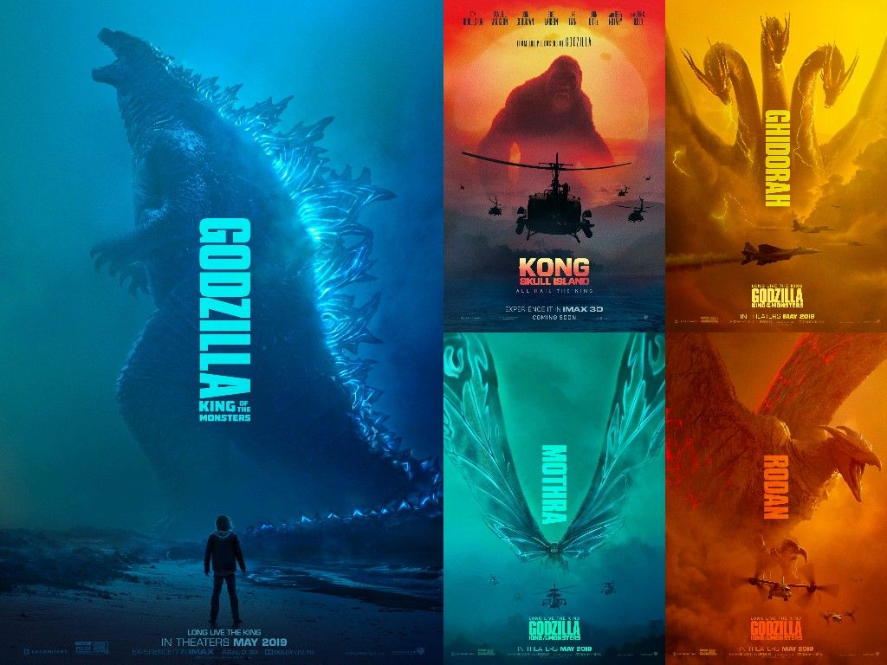
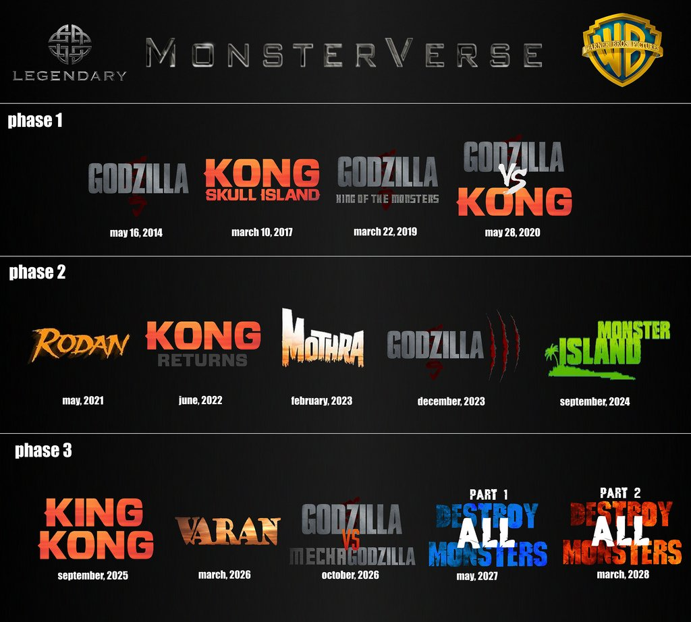
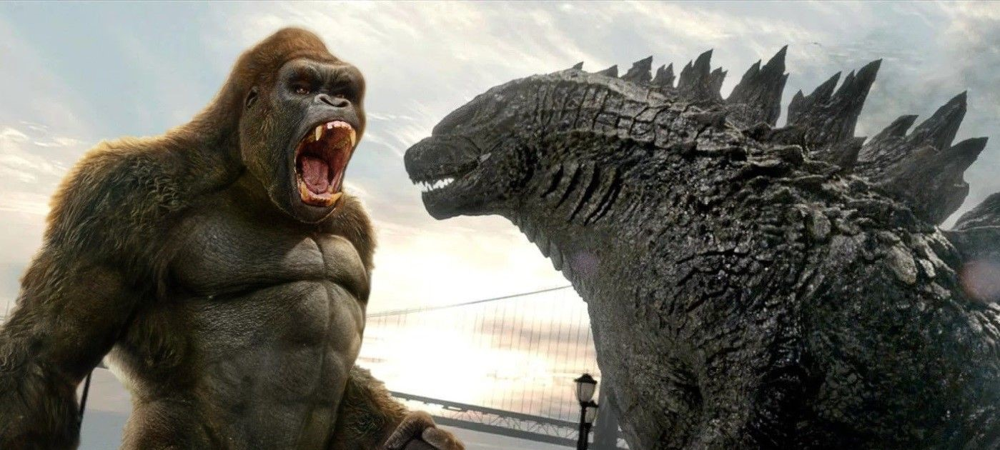

O novo filme é dirigido pelo cineasta Adam Wingard, sendo uma continuação de Godzilla II: Rei dos Monstros e Kong: Ilha da Caveira,
todos filmes do MonsterVerse da Legendary Entertainment.

### Monsterverse

É uma franquia americana e um universo ficcional compartilhado em uma série de filmes protagonizados pelos monstros King Kong e Godzilla.
A franquia é distribuída pela Warner Bros e produzida pela Legendary Entertainment em parceria com a Toho, que é uma produtora e distribuidora de filmes japonesa de Tóquio.

A franquia está em sua primeira fase, sendo que seus planos são muito maiores e podemos esperar pelo menos 3 fases e filmes até 2028.

Confira aqui alguns títulos cotados para as fases da franquia:

### Sinopse de Godzilla vs Kong (2021)

Em um mundo onde monstros andam pela terra, a humanidade luta pelo seu futuro, enquanto Godzilla e King Kong entram em uma rota de colisão,
mostrando assim as forças mais poderosas da natureza em uma batalha lendária.
Missões perigosas em um terreno desconhecido, pistas sobre a origem dos Titãs, e uma conspiração dos seres humanos que coloca em risco
a existência das criaturas para sempre na terra, sendo elas boas ou ruins.

### O que esperar deste confronto

Nós com certeza podemos esperar espaço para que as duas criaturas brilhem na produção, mas para quem iremos torcer?
É certo que o protagonismo vá para uma delas, mas qual? Segundo o diretor Adam Wingard, ‘’o mundo precisa de Kong para parar o que está por vir’’,
então apostamos que o protetor da vez seja King Kong. O que é uma escolha muito coerente com o que é proposto já pela franquia.

Já para Godzilla o negócio não parece estar muito bom, algo não está certo com ele. Ao que tudo indica Kaiju aparentemente está contra a humanidade.

Ainda não se sabe ao certo o porquê, e o que motiva os dois personagens a brigarem, entretanto, temos a garantia de que além do espetáculo visual do filme,
teremos tretas gigantescas, uma ação intensa, batalhas que realmente parecem sair direto de um vídeo game e muito do que se aprender desse multiverso.

Confira aqui o novo trailer do filme:

<iframe
  width="560"
  height="315"
  src="https://www.youtube.com/embed/aJMfEz2cobI"
  frameborder="0"
  allow="accelerometer; autoplay; clipboard-write; encrypted-media; gyroscope; picture-in-picture"
  allowfullscreen
></iframe>

_Compre o livro do filme na Pré-Venda com desconto_

<iframe
  style="width:120px;height:240px;"
  marginwidth="0"
  marginheight="0"
  scrolling="no"
  frameborder="0"
  src="//ws-na.amazon-adsystem.com/widgets/q?ServiceVersion=20070822&OneJS=1&Operation=GetAdHtml&MarketPlace=BR&source=ss&ref=as_ss_li_til&ad_type=product_link&tracking_id=dimensaosete-20&language=pt_BR&marketplace=amazon&region=BR&placement=B08R6PKDFS&asins=B08R6PKDFS&linkId=1c166c041f04aac61de9ba36b82e8aef&show_border=true&link_opens_in_new_window=false"
></iframe>
