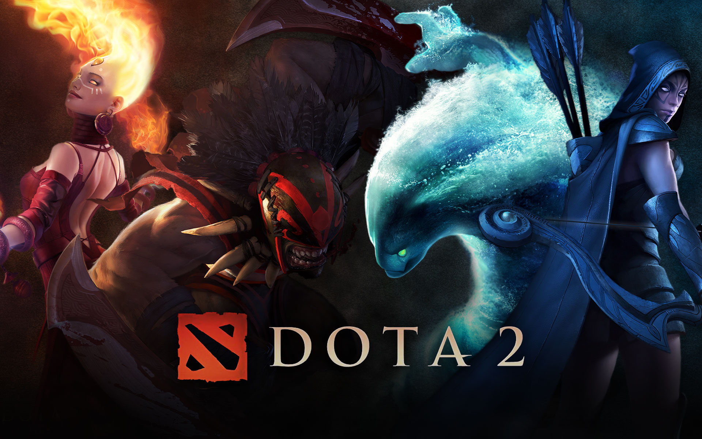

A série será lançada no dia 25 de março, com um total de 8 episódios e promete ser uma aventura épica cheia de batalhas e criaturas fantásticas.
Acompanhando a jornada do personagem Davion, um cavaleiro dragão renomado, que tem como missão de vida eliminar os monstros do mundo,
entretanto,a sua jornada muda quando conhece Mirana, uma princesa que também possui uma missão, ainda secreta. A dupla mudará suas vidas para sempre.
O novo projeto foi criado pela Valve Corporation, uma empresa americana que desenvolve jogos eletrônicos de distribuição digital e que é a desenvolvedora do game Dota.

### DOTA 2

É um jogo eletrônico gratuito lançado em julho de 2013, disponível na plataforma Steam. Com um gênero de batalha multijogador, é o jogo mais jogado no Steam,
todos os dias milhões de jogadores no mundo todo entram em batalhas com um dos mais de 100 heróis disponíveis.

Confira aqui o teaser do novo anime:

<iframe
  width="560"
  height="315"
  src="https://www.youtube.com/embed/oz1gOb6qjP8"
  frameborder="0"
  allow="accelerometer; autoplay; clipboard-write; encrypted-media; gyroscope; picture-in-picture"
  allowfullscreen
></iframe>

<iframe
  style="width:120px;height:240px; padding-right: 10px; margin-top: 30px"
  marginwidth="0"
  marginheight="0"
  scrolling="no"
  frameborder="0"
  src="//ws-na.amazon-adsystem.com/widgets/q?ServiceVersion=20070822&OneJS=1&Operation=GetAdHtml&MarketPlace=BR&source=ss&ref=as_ss_li_til&ad_type=product_link&tracking_id=dimensaosete-20&language=pt_BR&marketplace=amazon&region=BR&placement=1506703488&asins=1506703488&linkId=f265c015b7a3b5a4d02ee63d40079fee&show_border=true&link_opens_in_new_window=true"
></iframe>

<iframe
  style="width:120px;height:240px; padding-right: 10px;"
  marginwidth="0"
  marginheight="0"
  scrolling="no"
  frameborder="0"
  src="//ws-na.amazon-adsystem.com/widgets/q?ServiceVersion=20070822&OneJS=1&Operation=GetAdHtml&MarketPlace=BR&source=ss&ref=as_ss_li_til&ad_type=product_link&tracking_id=dimensaosete-20&language=pt_BR&marketplace=amazon&region=BR&placement=8550300861&asins=8550300861&linkId=3c38da03ceaa0fe33848d5d463a71e45&show_border=true&link_opens_in_new_window=true"
></iframe>

<iframe
  style="width:120px;height:240px;"
  marginwidth="0"
  marginheight="0"
  scrolling="no"
  frameborder="0"
  src="//ws-na.amazon-adsystem.com/widgets/q?ServiceVersion=20070822&OneJS=1&Operation=GetAdHtml&MarketPlace=BR&source=ss&ref=as_ss_li_til&ad_type=product_link&tracking_id=dimensaosete-20&language=pt_BR&marketplace=amazon&region=BR&placement=B07TJZPT75&asins=B07TJZPT75&linkId=d227b8c1f1e6bed14fa6f0adfaca6ce2&show_border=true&link_opens_in_new_window=true"
></iframe>
