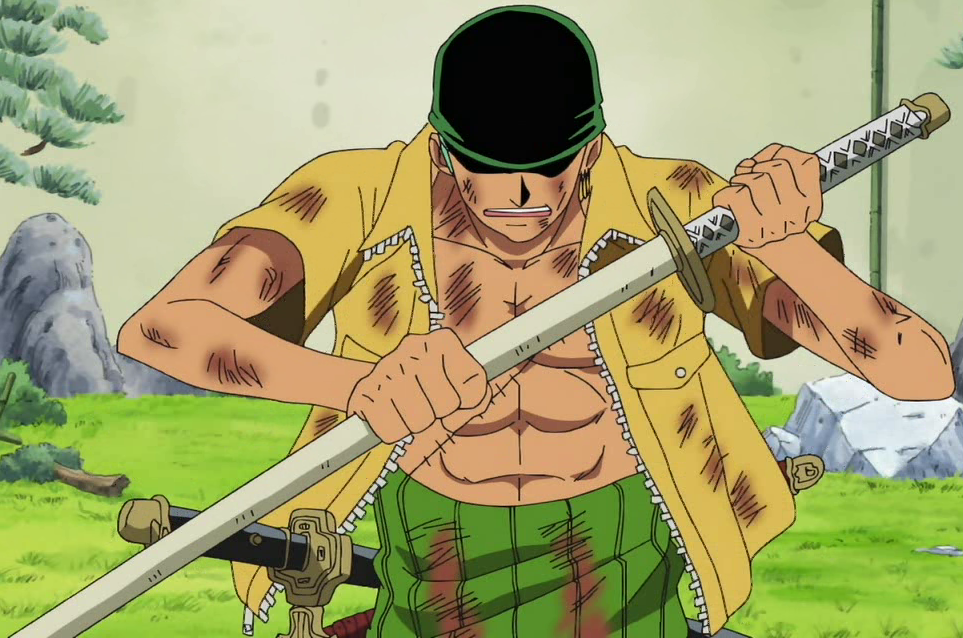
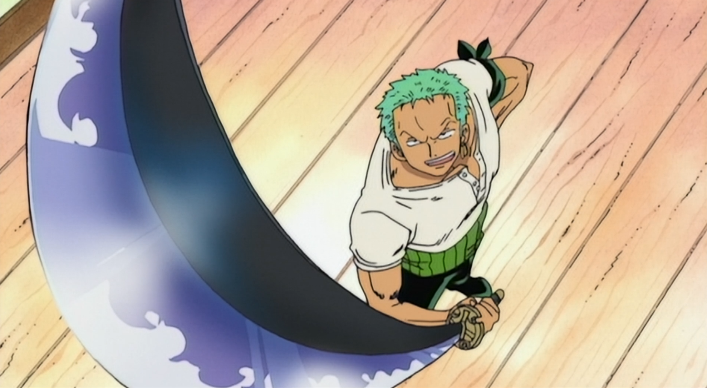
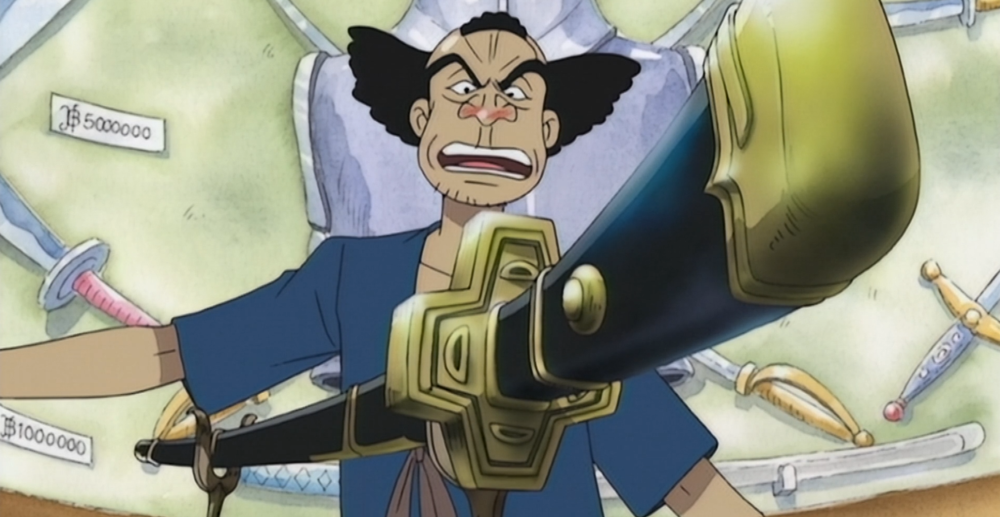
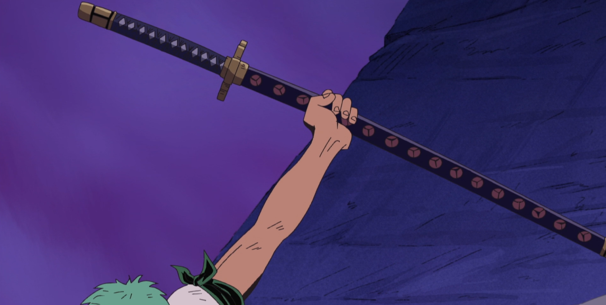
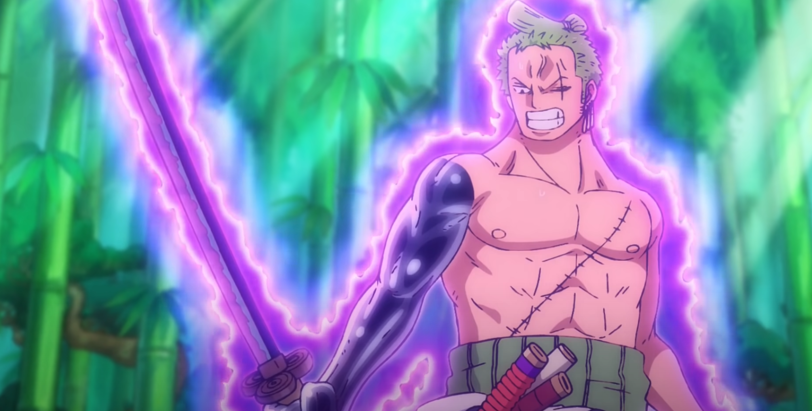

Roronoa Zoro, também chamado de O Caçador de Piratas, é o primeiro membro a se juntar ao bando do chapéu de palha.
Ele jurou para sua falecida amiga, Kuina, que iria se tornar o espadachim mais forte do mundo.
Durante a série de One Piece zoro utilizou diversas katanas, confira elas:

### Wado Ichimonji

A Wado Ichimonji é a espada mais importante para Zoro, ela pertencia a Kuina e sua família.
Após a sua morte, Zoro pediu ao pai dela a espada.

É uma das 21 Ō Wazamono que são consideradas as melhores espadas do mundo ficando abaixo apenas das 12 Saijō Ō Wazamono.

### Sandai Kitetsu

Zoro que teve suas espadas quebradas na luta contra o Mihawk entra numa loja de Katanas em Logue Town em busca de duas novas espadas.
Ele encontra a Sandai Kitetsu numa cesta de espadas comuns, o vendedor da loja, Ipponmatsu, decide que não pode vendê-la por se tratar
de uma espada amaldiçoada.

Zoro tenta sua sorte contra a maldição da espada e ganha, assim o vendedor se convence a vendê-la.

### Yubashiri

O dono da loja de espadas de Logue Town, Ipponmatsu, resolve dar a Zoro a katana Yubashiri ao ver
a coragem de Zoro em testar a maldição da Sandai Kitetsu.
Ela é uma das 50 Ryo Wazamono, sendo 1 grau abaixo da Wado Ichimonji.

A espada foi destruída em Enies Lobby por Shu, um capitão da Marinha que tem uma fruta do diabo capaz de enferrujar todo o tipo de metal.

### Shusui

Shusui é uma das 21 Ō Wazamono.

Zoro adquiriu ela após derrotar o Zumbi do lendário samurai Ryuma de Wano. Ryuma entrega a espada a Zoro após perder um duelo contra ele.

### Enma

Enma é uma das 21 Ō Wazamono.

Em Wano Kozuki Hiyori pedi a zoro para devolver a espada Shusui ao túmulo de Ryuma e em troca ela
daria a espada Enma, deixada como herança para ela, pelo seu falecido pai, Kozuki Oden.
Enma é uma espada extremamente difícil de manejar, com Oden sendo o único a tê-la domado.
Isso se deve à qualidade excessiva de Haki que ela drena do usuário, um espadachim normal teria sido drenado até se tornar uma casca seca ao empunha-la.

_Compre **com desconto** volumes de One Piece_ - <a href="https://amzn.to/2NVpfGn">Clique aqui!</a>

<iframe
  style="width:120px;height:240px; padding-right: 10px; margin-top: 30px"
  marginwidth="0"
  marginheight="0"
  scrolling="no"
  frameborder="0"
  src="//ws-na.amazon-adsystem.com/widgets/q?ServiceVersion=20070822&OneJS=1&Operation=GetAdHtml&MarketPlace=BR&source=ss&ref=as_ss_li_til&ad_type=product_link&tracking_id=dimensaosete-20&language=pt_BR&marketplace=amazon&region=BR&placement=854260217X&asins=854260217X&linkId=377d6766621a4eaf53471c0d8b963998&show_border=true&link_opens_in_new_window=true"
></iframe>

<iframe
  style="width:120px;height:240px; padding-right: 10px;"
  marginwidth="0"
  marginheight="0"
  scrolling="no"
  frameborder="0"
  src="//ws-na.amazon-adsystem.com/widgets/q?ServiceVersion=20070822&OneJS=1&Operation=GetAdHtml&MarketPlace=BR&source=ss&ref=as_ss_li_til&ad_type=product_link&tracking_id=dimensaosete-20&language=pt_BR&marketplace=amazon&region=BR&placement=8542603141&asins=8542603141&linkId=8a4f463f5849dd00d2f9e811d5006287&show_border=true&link_opens_in_new_window=true"
></iframe>

<iframe
  style="width:120px;height:240px;"
  marginwidth="0"
  marginheight="0"
  scrolling="no"
  frameborder="0"
  src="//ws-na.amazon-adsystem.com/widgets/q?ServiceVersion=20070822&OneJS=1&Operation=GetAdHtml&MarketPlace=BR&source=ss&ref=as_ss_li_til&ad_type=product_link&tracking_id=dimensaosete-20&language=pt_BR&marketplace=amazon&region=BR&placement=8573519282&asins=8573519282&linkId=1cab3c47e383c4c0909ff4ee4ec5d5c9&show_border=true&link_opens_in_new_window=true"
></iframe>
